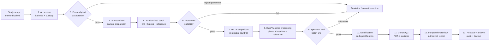

# RuuPhenome real-laboratory pipeline

This is the operational path for moving RuuPhenome from a software prototype
into an NMR metabolomics laboratory. It is a **research-use workflow**, not a
claim that the current application is a validated clinical diagnostic system.

## How one sample moves through the laboratory

1. **Study setup and method lock**  
   The laboratory director and study owner define the matrix, intended use,
   sample acceptance rules, acquisition method, QC limits, analysis plan,
   software/library versions and randomized run order before seeing results.

2. **Accession and chain of custody**  
   Each physical tube receives a barcode and pseudonymous sample ID. The LIMS
   records collection, receipt, storage, freeze-thaw history, handlers and every
   custody transfer. A filename must never be the primary specimen identity.

3. **Pre-analytical acceptance**  
   A technician checks tube type, volume, integrity, transport/processing time,
   temperature history and matrix-specific interference or degradation signs.
   Failed identity is quarantined—not guessed or manually “fixed.”

4. **Standardized preparation**  
   Samples are thawed, mixed and centrifuged under one locked SOP. Fixed volumes
   of sample, buffer, D2O and DSS/TSP/internal standard are added. The batch also
   receives pooled study QC, process blank, solvent blank and reference material.

5. **Batch assembly**  
   Study samples are randomized so biological groups do not align with run
   order. Pooled QCs are placed at the beginning, end and a validated periodic
   interval. Blanks are positioned to expose contamination and carry-over.

6. **Instrument suitability**  
   The operator confirms maintenance, probe, temperature, tune/match, lock,
   shimming, line shape, sensitivity, water suppression and chemical-shift
   reference using a suitability material. Failure stops the batch.

7. **Acquisition**  
   The locked 1D ¹H method is acquired. The original Bruker experiment directory
   is retained read-only and checksummed. Reprocessing never overwrites raw data.

8. **RuuPhenome processing**  
   The zipped experiment is submitted to `POST /process-fid`. The application
   validates the archive, removes the Bruker digital filter, performs DC
   correction, apodization, zero-fill, FFT, phasing, baseline correction,
   internal-standard referencing, normalization and robust peak picking.

9. **Spectrum and batch QC gate**  
   Per-spectrum QC is combined with pooled-QC precision, run-order drift,
   blanks, instrument suitability and sample-identity evidence. The sample
   receives `pass`, `fail` or `needs_review`; only `pass` permits release into
   interpretation. Use `POST /laboratory-workflow/evaluate-qc`.

10. **Identification and quantification**  
    Analysts review complete resonance patterns, ppm errors and ambiguity.
    Self-supervised embedding matches are supporting evidence only. A result is
    not a concentration unless matrix-specific calibration, traceability,
    accuracy, precision and range have been validated.

11. **Cohort QC and statistics**  
    PCA is used to inspect outliers, drift and batch effects. UMAP may be used
    for exploratory visualization but not as proof of biological separation.
    Patient grouping, preprocessing and feature selection remain inside
    cross-validation folds.

12. **Independent review**  
    A second qualified reviewer checks identity, QC, assignments, units,
    exclusions, methods and limitations. The laboratory director authorizes the
    final report.

13. **Release and archive**  
    The laboratory archives the raw FID, checksums, metadata, processed
    spectrum, parameters, software/model versions, QC decisions, manual edits,
    signatures and report. Backup restoration is tested periodically.

## Current software boundary

RuuPhenome currently implements the central analytical section:

- Bruker/numeric spectrum processing and per-spectrum QC;
- chemical-shift referencing, peak detection and explainable assignments;
- open-data self-supervised reference similarities;
- leakage-safe biomarker modelling;
- a machine-readable workflow at `GET /laboratory-workflow`;
- a conservative release evaluator at
  `POST /laboratory-workflow/evaluate-qc`.

Production laboratory use still requires:

- LIMS/barcode integration, authentication and role-based access;
- append-only audit history and electronic signatures;
- validated matrix-specific SOPs and QC acceptance limits;
- calibration and reference materials for reported concentrations;
- external performance validation and proficiency testing;
- cybersecurity, backup, retention and disaster-recovery controls.

## Default QC evaluator

The included evaluator uses visible research defaults:

- spectrum QC score ≥ 75;
- maximum SNR ≥ 20;
- negative spectral area ≤ 0.20;
- internal-standard referencing confirmed;
- pooled-QC CV ≤ 20%;
- absolute batch drift ≤ 20%;
- no blank contamination;
- instrument suitability and sample identity confirmed.

Missing evidence returns `needs_review`; it never silently passes. These values
must be replaced by limits validated for the laboratory's matrix, instrument,
sample preparation and intended use.

## Standards used to structure this workflow

- [ISO 15189:2022](https://www.iso.org/standard/76677.html) — medical-laboratory
  quality and competence.
- [ISO 23118:2021](https://www.iso.org/standard/74605.html) — pre-examination
  handling and documentation for metabolomics in urine, serum and plasma.
- [ICH M10](https://www.fda.gov/media/162903/download) — fit-for-purpose
  bioanalytical validation and study-sample analysis principles.
- [Metabolomics Standards Initiative](https://doi.org/10.1007/s11306-007-0082-2)
  — minimum reporting for preparation, analysis, QC, identification and
  preprocessing.
- [MetaboLights guides](https://www.ebi.ac.uk/metabolights/editor/guides) —
  structured study, sample and protocol metadata.
